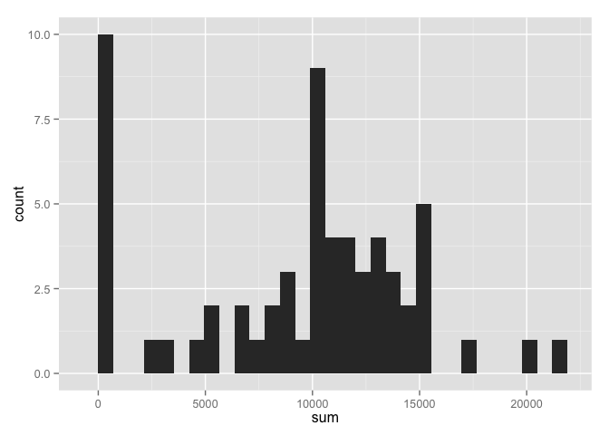
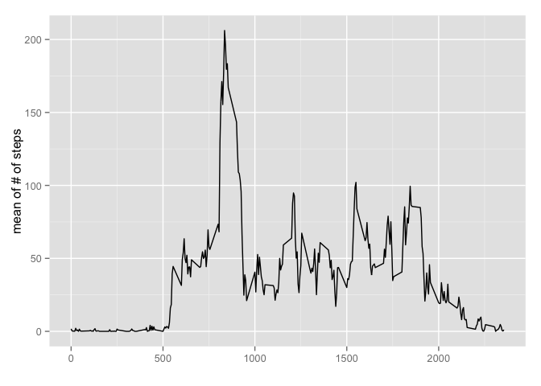
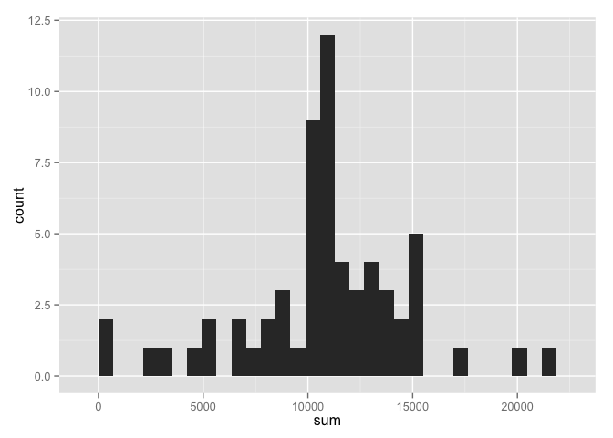
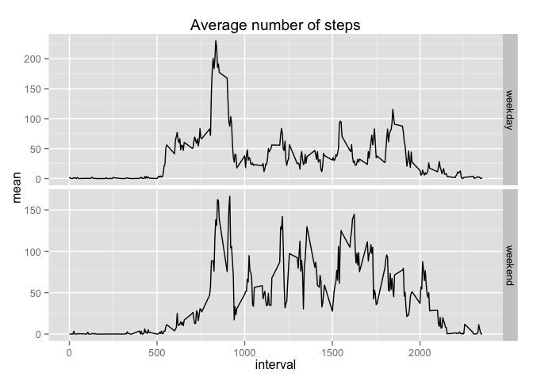

# Reproductive data assignment 1
## What is mean total number of steps taken per day?
We read the .csv file first using the read.csv function. In first assignment we were supposed to calculate the number of steps per day. For that reason I used the group_by function and then using the function summarise I calculated the number of steps.


```r
library(dplyr)
```

```
## 
## Attaching package: 'dplyr'
## 
## The following object is masked from 'package:stats':
## 
##     filter
## 
## The following objects are masked from 'package:base':
## 
##     intersect, setdiff, setequal, union
```

```r
data<-read.csv("activity.csv")
group<-group_by(data,date)
stp<-summarise(group,sum(steps,na.rm=T))
names(stp)=c("date","sum")
```
Now the data of the previous code should be represented as a histogram

```r
library(ggplot2)
qplot(sum, data=stp, geom="histogram")
```

```
## stat_bin: binwidth defaulted to range/30. Use 'binwidth = x' to adjust this.
```

 

Mean of the total number of steps is: 9354.2295082. 

Median of the total number of steps is: 10395.

## What is the average daily activity pattern?
The time series plot of the average number of steps taken, averaged across all days

```r
inter<-group_by(data,interval)
meal<-summarise(inter,mean(steps,na.rm=T))
names(meal)<-c("interval","mean")
ggplot(meal, aes(interval, mean)) + geom_line() + xlab("") + ylab("mean of # of steps")
```

 

The maximum value of steps occured in the 5 minute interval of the number: 835

I found this number by:

```r
meal$interval[meal$mean==max(meal$mean,na.rm=T)]
```

```
## [1] 835
```

## Imputing missing values
The number of the missing values is 17568.

It was calculated using:

```r
length(data$steps[data$steps==NA])
```

```
## [1] 17568
```

We can replace the NA values using one of the strategies suggested in the assignment. I will use the NA replaced by the mean found in previous "average over dates" procedure:

```r
x<-data.frame(data$interval,data$steps)
for(i in 1:nrow(x)){if(is.na(x$data.steps[i])){x$data.steps[i]<-meal$mean[meal$interval==x$data.interval[i]]}}
names(x)<-c("interval","steps")
```

Creating a new dataset, that is equal to the original, but with the NA values replaced by the above procedure:

```r
ndat<-data.frame(x$steps,data$date,x$interval)
names(ndat)<-c("steps","date","interval")
```

Now I will do the same type of histogram as before, difference is the use of the new data frame "ndat" with modeled values of NA:


```r
group<-group_by(ndat,date)
stp<-summarise(group,sum(steps,na.rm=T))
names(stp)=c("date","sum")
qplot(sum, data=stp, geom="histogram")
```

```
## stat_bin: binwidth defaulted to range/30. Use 'binwidth = x' to adjust this.
```

 

Mean of the total number of steps is: 1.0766189\times 10^{4}. 

Median of the total number of steps is: 1.0766189\times 10^{4}.

The conclusion might be that implementing the missing values as the model described above. We might see two main things:

the number of steps in the zeroth bin has been significantly decreased. What is expected because we know that the original very high number of 
steps in the zeroth bin is highly spoiled by the NA->0 replacement in the original procedure.

the mean and median are slightly higher and also the maximum has been increased.

## Are there differences in activity patterns between weekdays and weekends?


```r
mm<-cbind(ndat,data.frame(weekdays(as.Date(data$date))))
names(mm)<-c(names(data),"weekdays")
mm$weekdays<-as.character(mm$weekdays)
for(i in 1:nrow(mm)){if(mm$weekdays[i]==c("Saturday")|mm$weekdays[i]==c("Sunday")){mm$weekdays[i]<-"weekend"}else{mm$weekdays[i]<-"weekday"}}
mm$weekdays<-as.factor(mm$weekdays)
head(mm)
```

```
##       steps       date interval weekdays
## 1 1.7169811 2012-10-01        0  weekday
## 2 0.3396226 2012-10-01        5  weekday
## 3 0.1320755 2012-10-01       10  weekday
## 4 0.1509434 2012-10-01       15  weekday
## 5 0.0754717 2012-10-01       20  weekday
## 6 2.0943396 2012-10-01       25  weekday
```

Now I will panel plot the time series of  of the 5-minute interva and the average number of steps taken, averaged across all weekday days or weekend days:

```r
ex<-group_by(mm,interval,weekdays)
juch<-summarise(ex,mean(steps,na.rm=T))
names(juch)<-c("interval","weekdays","mean")
g<-ggplot(juch,aes(interval,mean))
p<-g+geom_line()+facet_grid(weekdays ~ .,scales = "free") + ggtitle("Average number of steps")
p
```

 
